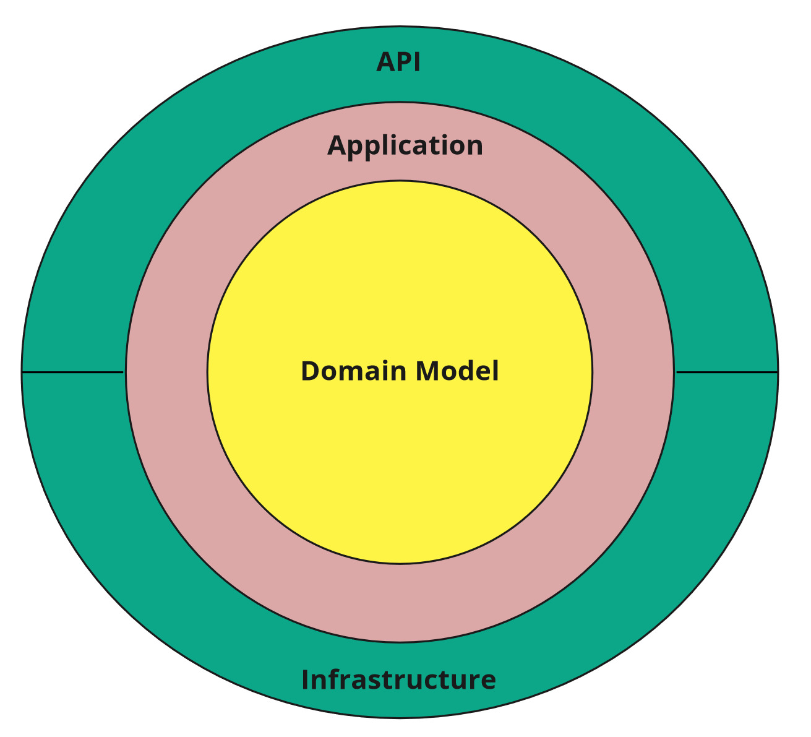

# Тестовое задание Microservices-Dotnet-Docker-RabbitMq-CleanArchitecture.
## Test task for creating two microservices in Docker. Microservice Service2 using Clean Architecture.

### Стэк:

- NET Core
- MediatR
- MassTransit(реализует паттерн шины для RabbitMq)
- AutoMapper (приведение одних типов классов к другим)
- Serilog
- Entity Framework
- Docker
- Postgres(MS SQL)
- FluentValidation

### Задание:

В Docker поднять:
- RabbitMq
- 2 сервиса, которые будут между собой общаться по шине
- БД любую из перечисленных

## 1 сервис:
Принимает запросы типа post (идентификатор, имя, фамилия, отчество, email)
Предусмотреть простую валидацию что все кроме отчества должно быть заполнено.
В бизнес логике этого запроса отправлять по шине полученную информацию на 2 сервис.
Так же при отправке в консоль выводить логирование (сообщение о отправке вышеперечисленных данных)

## 2 сервис:
Принять сообщение с шины и положить его в БД (таблица Users) и залогировать это в консоль.
Так же у сервиса есть post запрос который связывает пользователя с организацией (таблица Organizations)
И post-запрос который возвращает пагинацию пользователей по организации. (когда возвращаем ответ используем AutoMapper)
При старте сделать seed в БД если там ничего нет.

## БД:
> Таблица Users:
Ключ пользователя + Ключ организации к которой привязан пользователь + Информация о пользователе
Таблица Organizations:
Ключ организации + Название организации

Написать юнит тесты

# Реализация (Implementation).

Создано 2 микросервиса: Service1 и Service2.

#### Service1
Прост и реализован в одном проекте "Service1.Api".

#### Service2
Service2 написан борлее сложен и написан показательно.
Использует чистую Clean (луковую/гексагональную) архитектуру.
##### Clean Architecture

##### CQRS
Используется паттерн CQRS для разделения интерфейса уровня инфраструктуры на репозиторий команд и репозиторий запросов.
Commands/Queries используют паттерн посредник для слабой связанности между слоями сервиса с помощью библиотеки MediatR.

## How to run application
Запустить проект "docker-compose" в докере.

Сервисы будут доступны по URL:
|  | URI |
| ------ | ------ |
| Service1 | http://localhost:42000/swagger/index.html |
| Service2 | http://localhost:42001/swagger/index.html |
| RabbitMq | http://localhost:15672/#/queues |

#### БД
| Postgres |  |
| ------ | ------ |
| URI | localhost |
| Порт | 8001 |
| Пользователь | postgres |
| Пароль | dbpwd |
